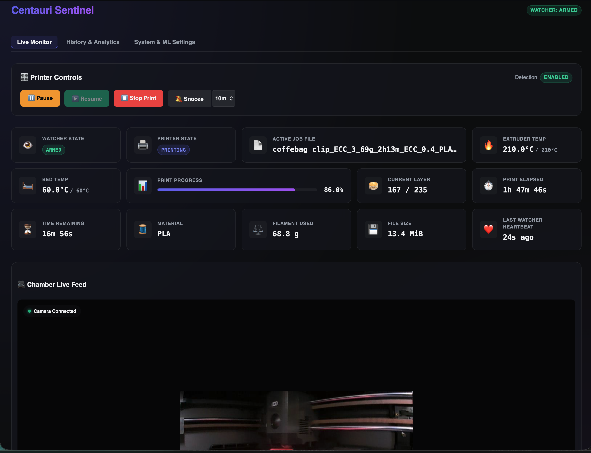
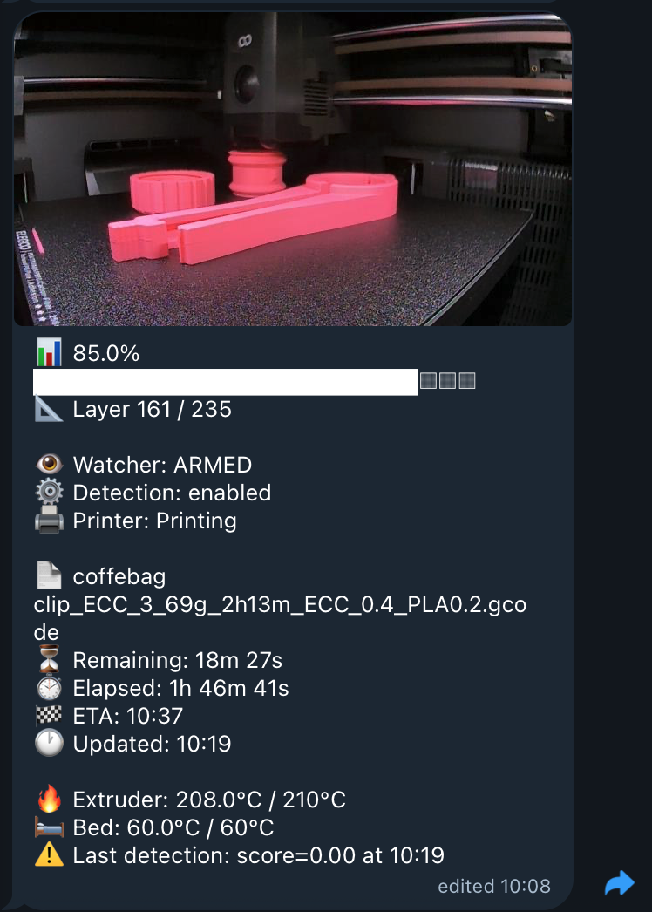
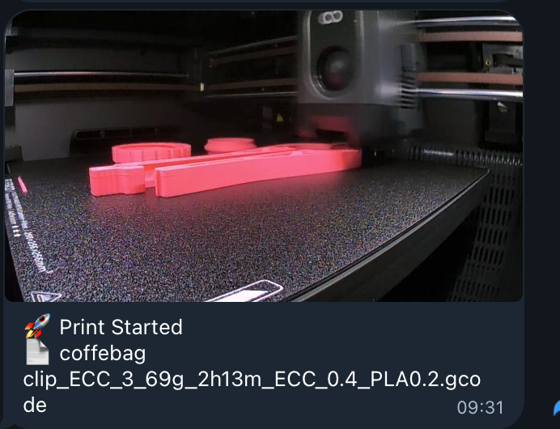
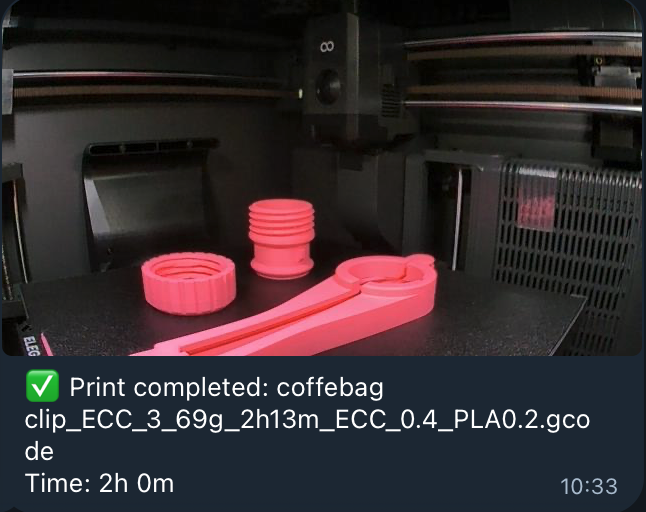
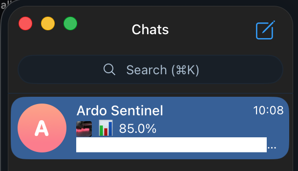

# Centauri Sentinel for Elegoo Centauri Carbon 2

> **Xloaded community fork**
>
> Enhanced Elegoo Centauri Carbon 2 support with firmware 02.x compatibility,
> Telegram live print progress, photo status cards, and native printer error alerts.
>
> Based on the original [LegalMarc/centauri-sentinel](https://github.com/LegalMarc/centauri-sentinel).
> Original authorship and licensing are preserved.

**Centauri Sentinel** is a self-hosted monitoring, failure-detection and notification system for the **ELEGOO Centauri Carbon 2 (CC2)** 3D printer.

This community fork adds **firmware 02.x support**, **Telegram live print progress**, camera snapshots, native printer error alerts, and remote printer monitoring while preserving the original Centauri Sentinel functionality.

It watches the camera feed with the [Obico](https://github.com/TheSpaghettiDetective/obico-server) ML model, pauses the printer on confirmed print failures, and alerts via Telegram and/or ntfy.

---

## What it does

centauri-sentinel connects to your printer over LAN, grabs frames from its MJPEG camera every
10 seconds, and scores them against the Obico failure-detection model. When a set number of
consecutive frames all exceed the confidence threshold, it pauses the print, sends you an alert
with a snapshot, and waits for your decision. A Telegram bot lets you resume or abort the print
from your phone. A local web dashboard shows live camera feed, watcher state, and detection
history.

---

## Xloaded fork additions

In addition to the original Sentinel functionality, this fork adds:

- **Firmware 02.x support** for the Elegoo Centauri Carbon 2.
- **Telegram live print status** with a current camera snapshot.
- **Automatic progress updates** approximately every 5 minutes without filling the chat with new notifications.
- **Silent milestone refreshes** at 1%, 25%, 50%, and 75% progress, giving an early live status card shortly after printing begins.
- **Live browser-tab progress** while printing or paused, for example `9% Printing · Centauri Sentinel`.
- **Remote printer controls** from the web dashboard, including Pause, Resume, Stop, and watcher Snooze.
- **Detailed /status** with percentage, layer, filename, ETA, temperatures, watcher state and detection state.
- **Native printer error alerts** from firmware 02.x machine_status.exception_status.
- **Active printer errors in /status**.
- **Error deduplication** so an active fault alerts once, but can alert again after it clears and reoccurs.
- **Improved firmware 02.x print-start handling** so Telegram waits for the real filename instead of showing Unknown file.
- **Centauri Carbon 2 / Canvas error descriptions**, including filament feed, retract, cutter, blockage and tangling faults.

Example progress:

    📊 40.0%
    ████████░░░░░░░░░░░░
    📐 Layer 54 / 235
    🖨 Printer: Printing
    ⏱ Remaining: 1h 21m
    🎯 ETA: 10:50
    🌡 Extruder: 220°C
    🌡 Bed: 60°C

Example printer error:

    ⚠️ Printer Error
    ⚠️ Canvas: Filament Tangling (1263)


---

## Screenshots

### Sentinel dashboard

Live Centauri Carbon 2 status, camera view, temperatures, print progress and ML monitoring.



### Telegram live print progress

A live camera snapshot together with print percentage, layer, ETA, temperatures and detection status.



### Print started notification

Sentinel sends a camera snapshot and the actual print filename when a print starts.



### Print completed notification

When the print finishes, Sentinel sends the completed filename, total print time and final camera snapshot.



### Telegram chat preview

Progress milestone updates at 1%, 25%, 50%, and 75% are sent silently so the latest print percentage and snapshot remain visible directly in the Telegram chat list.



---

## Hardware

- **Printer:** Elegoo Centauri Carbon 2 (Carbon 1 not supported — different MQTT API)
- **Host:** any Docker-capable Linux host on the same LAN as the printer (amd64 or arm64)
- **Tested firmware:** Centauri Carbon 2 1.x and 02.01.00.00 (MQTT broker at port 1883)

### Firmware 02.x compatibility

Firmware 02.x no longer provides all print-state data in the MQTT status push used by
earlier firmware. centauri-sentinel keeps a persistent registered MQTT session and uses
`GET_STATUS` (1002) to refresh print state, progress, layers, temperatures, and timing.
`GET_FILE_DETAIL` (1046) is used for active-file metadata such as material, filament usage,
file size, and total layer count. Earlier firmware behaviour remains supported.

---

## Deployment baseline — LAN trust

> **Security assumption:** the Coolify host and the printer share a trusted LAN.
>
> The status dashboard and camera stream are **not authenticated by default**.
> Do **not** expose port 8000 to the public internet without enabling auth (`AUTH_USERNAME` +
> `AUTH_PASSWORD_BCRYPT`) **and** placing the service behind a TLS-terminating reverse proxy.
>
> The startup guard (`EXTERNAL_BIND_ALLOWED=false`) refuses to start if the host is reachable
> externally and auth is not configured — but this guard is host-binding heuristic only.
> See [docs/threat-model.md](docs/threat-model.md) for the full analysis.

---

## Deployment

centauri-sentinel runs as a three-service Docker Compose stack (`token-init`,
`obico-ml`, `sentinel`). Pick whichever fits your setup:

- **[Docker](#quick-start-docker)** — run it directly on any Docker host. Full guide: **[docs/docker-deploy.md](docs/docker-deploy.md)**.
- **[Coolify](#quick-start-coolify)** — deploy via the Coolify PaaS UI. Full guide: **[docs/coolify-deploy.md](docs/coolify-deploy.md)**.

### Quick start (Docker)

```sh
git clone https://github.com/Xloaded/centauri-sentinel.git
cd centauri-sentinel
cp .env.example .env
# edit .env: set PRINTER_IP and PRINTER_ACCESS_CODE
docker compose up -d --build
```

The dashboard is at `http://<host-ip>:8000` once the `sentinel` service reports
healthy (`docker compose ps`).

> **If you enable auth:** generate the password hash with
> `python -m sentinel hash-password --file ./secrets/auth_hash` and point
> `AUTH_PASSWORD_BCRYPT_FILE` at it — no `$`-escaping needed. (If you'd rather
> inline `AUTH_PASSWORD_BCRYPT` in `.env`, you must double every `$` to `$$`;
> the helper prints that pre-escaped form too.) See
> [docs/docker-deploy.md](docs/docker-deploy.md#enable-dashboard-auth-recommended).

### Quick start (Coolify)

1. In Coolify → **New Resource** → **Docker Compose** → paste this repo URL.
2. Add env var `PRINTER_IP=<your printer's LAN IP>`.
3. Add env var `PRINTER_ACCESS_CODE=<access code from printer Settings → Network>`.
4. Click **Deploy**. All three services become healthy in under 90 s.

The dashboard is at the URL Coolify assigns (e.g. `https://<uuid>.your-domain.com`).

> **If you enable auth:** Coolify writes env vars into a generated `.env`, so an
> inline `AUTH_PASSWORD_BCRYPT` needs each `$` doubled to `$$`. Generate the
> hash with `python -m sentinel hash-password` (it prints the pre-escaped form),
> or mount a secret file and use `AUTH_PASSWORD_BCRYPT_FILE`. See the
> [Coolify guide](docs/coolify-deploy.md#enabling-dashboard-auth--escape--as-) for details.

---

## Configuration reference

`PRINTER_IP` and `AUTH_USERNAME` are required by the Docker Compose deployment. Dashboard authentication also requires a password hash.

### Printer

| Variable | Default | Purpose |
|---|---|---|
| `PRINTER_IP` | **required** | LAN IP of the Centauri Carbon 2 |
| `PRINTER_ACCESS_CODE` | `123456` | MQTT broker password — find it in the printer's Settings → Network |
| `PRINTER_MQTT_PORT` | `1883` | MQTT broker port |
| `PRINTER_MJPEG_PORT` | `8080` | Camera stream port |
| `PRINTER_MJPEG_PATH` | `/mjpeg` | Camera stream path |

### ML detection

| Variable | Default | Purpose |
|---|---|---|
| `ML_API_URL` | `http://obico-ml:3333` | Internal URL of the Obico ML container |
| `ML_API_TOKEN_FILE` | `shared/token` | Path to the shared auth token (written by `token-init`); override to `/shared/token` when using Docker Compose |
| `ML_CONFIRM_COUNT` | `3` | Consecutive positive frames before triggering a pause |
| `ML_POLL_INTERVAL_SECONDS` | `10` | Seconds between frame grabs |
| `ML_SCORE_THRESHOLD` | `0.4` | Per-frame confidence threshold (0.0 – 1.0) |
| `ML_CONSECUTIVE_FAILURE_THRESHOLD` | `10` | Consecutive ML API failures before disabling detection |
| `ML_CALLBACK_HOST` | — | Override the hostname used in ML callback URLs (optional) |

### Detection behaviour

| Variable | Default | Purpose |
|---|---|---|
| `DETECTION_WARMUP_SECONDS` | `300` | Seconds after print start before arming (skips first-layer purge) |
| `DETECTION_ENABLED_DEFAULT` | `true` | Initial detection state — can be toggled at runtime via bot |
| `WATCHER_STALL_SECONDS` | `60` | Heartbeat age that triggers a stall alert |
| `AUTO_STOP_TIMEOUT_SECONDS` | `0` | Auto-stop the print after this many seconds of being paused by Sentinel (0 to disable). Must be 0 or >= 60. |
| `RESUME_COOLDOWN_SECONDS` | `5` | Minimum seconds between consecutive resumes |

### Notifications (general)

| Variable | Default | Purpose |
|---|---|---|
| `NOTIFY_ON_PRINT_START` | `true` | Send a notification when a print job starts |
| `NOTIFY_ON_PRINT_COMPLETED` | `true` | Send a notification when a print job completes |
| `NOTIFY_ON_PRINT_PAUSED` | `true` | Send a notification when a print is paused by Sentinel |

### Telegram (optional)

Disabled if `TELEGRAM_BOT_TOKEN` is unset.

| Variable | Default | Purpose |
|---|---|---|
| `TELEGRAM_BOT_TOKEN` | — | Bot token from @BotFather |
| `TELEGRAM_CHAT_ID` | — | Chat to send alerts to |
| `TELEGRAM_USER_IDS` | — | Comma-separated list of authorised user IDs |
| `TELEGRAM_SEND_SNAPSHOTS` | `false` | Set `true` to upload camera snapshots to Telegram with each alert (opt-in; see Privacy Notice below) |

See [Telegram setup](#telegram-setup) below.

### ntfy (optional)

Disabled if `NTFY_URL` is unset.

| Variable | Default | Purpose |
|---|---|---|
| `NTFY_URL` | — | Topic URL, e.g. `https://ntfy.sh/your-long-random-topic` |
| `NTFY_TOKEN` | — | Bearer token for self-hosted ntfy with auth |
| `NTFY_SEND_SNAPSHOTS` | `false` | Set `true` to upload camera snapshots with each ntfy alert (opt-in; see Privacy Notice below) |

See [ntfy setup](#ntfy-setup) below.

### Dashboard authentication

Dashboard authentication is required by the Docker Compose deployment. The dashboard presents an
HTML login form (password-manager friendly); non-browser clients may still use
HTTP Basic Auth.

| Variable | Default | Purpose |
|---|---|---|
| `AUTH_USERNAME` | **required** | Dashboard login username |
| `AUTH_PASSWORD_BCRYPT_FILE` | — | **Preferred.** Path to a file containing the bcrypt hash. No `$`-escaping, and the hash stays out of `docker inspect`. Takes precedence over `AUTH_PASSWORD_BCRYPT` |
| `AUTH_PASSWORD_BCRYPT` | — | bcrypt hash inline (required when `AUTH_USERNAME` is set and no file is given). **In a `.env` file you must escape every `$` as `$$`** |
| `AUTH_COOKIE_SECURE` | `auto` | Session cookie `Secure` flag: `auto` (set when HTTPS detected), `always`, or `never` |

**Generate the hash with the built-in helper** (prompts securely, no need to
hand-write Python):

```sh
# Write it straight to a file for AUTH_PASSWORD_BCRYPT_FILE (recommended):
python -m sentinel hash-password --file ./secrets/auth_hash

# Or print it — shows the raw hash AND a pre-escaped AUTH_PASSWORD_BCRYPT= line:
python -m sentinel hash-password
```

> **Why two options?** A bcrypt hash is full of `$` separators (`$2b$12$…`), and
> Docker Compose interpolates `$` in `.env` values — so an inline hash gets
> silently corrupted unless every `$` is doubled to `$$`, which manifests as
> every login failing with "Invalid username or password." Using
> `AUTH_PASSWORD_BCRYPT_FILE` sidesteps this entirely: file contents are not
> interpolated. The `hash-password` helper prints the correctly-escaped inline
> form if you prefer the env-var route.

> **Note:** Plaintext `AUTH_PASSWORD` is not accepted — it would be visible via
> `docker inspect`. Use a bcrypt hash via either variable above.

### Web server

| Variable | Default | Purpose |
|---|---|---|
| `BIND_HOST` | `0.0.0.0` | Address to bind on |
| `BIND_PORT` | `8000` | Port to bind on (inside the container) |
| `SENTINEL_PORT` | `8000` | Host-side port published by Docker Compose |
| `EXTERNAL_BIND_ALLOWED` | `false` | Set `true` only with auth + TLS at reverse proxy |
| `TRUST_PROXIES` | `false` | Trust X-Forwarded-For headers for IP checking when behind a reverse proxy |

### Misc

| Variable | Default | Purpose |
|---|---|---|
| `LOG_LEVEL` | `INFO` | `DEBUG`, `INFO`, `WARNING`, `ERROR`, or `CRITICAL` |
| `LOG_FORMAT` | `text` | Log output format: `text` or `json` |
| `DB_PATH` | `/data/sentinel.db` | SQLite database path (should be on a named volume) |
| `SNAPSHOT_RETENTION_LIMIT` | `50` | Maximum number of snapshot files to keep on disk. Oldest files are deleted periodically |
| `SNAPSHOT_CLEANUP_INTERVAL_SECONDS` | `3600` | How often (in seconds) the snapshot cleanup task runs |
| `EVENT_RETENTION_DAYS` | `0` | Days to keep historical detection/pause records in SQLite (0 = unlimited) |
| `CAMERA_MAX_STREAMS` | `3` | Maximum simultaneous MJPEG stream connections |

---

## Telegram setup

For live progress cards, snapshots, print lifecycle notifications and printer error alerts, see the **[Telegram integration guide](docs/telegram.md)**.

1. Open [@BotFather](https://t.me/BotFather) on Telegram and send `/newbot`. Follow the prompts.
   Copy the **bot token** — this is `TELEGRAM_BOT_TOKEN`.

2. **Start a chat with your bot first.** Open Telegram, search for your bot by its username,
   and send `/start`. Without this step `getUpdates` will return an empty list and you cannot
   retrieve your chat ID.

3. Find your **chat ID**:
   ```
   https://api.telegram.org/bot<YOUR_TOKEN>/getUpdates
   ```
   Look for `"chat":{"id":...}` in the response. A personal chat gives a positive integer;
   a group gives a negative integer. This is `TELEGRAM_CHAT_ID`.

4. Find your **user ID**: look for `"from":{"id":...}` in the same response. This is your entry
   in `TELEGRAM_USER_IDS`. Add more users by comma-separating their IDs.

**Security & Privacy notes:**
- centauri-sentinel enforces an allowlist on both chat ID and user ID. Messages from unknown
  chats or users are silently ignored.
- The `/stop` command requires a `/confirm` within 30 seconds to prevent accidental pauses.
- **Privacy Notice:** By default, Telegram notifications are text-only. Set `TELEGRAM_SEND_SNAPSHOTS=true` to opt in to uploading camera snapshots to Telegram's servers with each alert.

**Available bot commands:**

| Command | Description |
|---|---|
| `/status` | Current watcher state and last heartbeat |
| `/snapshot` | Camera snapshot |
| `/pause` | Pause the print immediately |
| `/resume` | Resume after a pause |
| `/stop` | Initiate a stop (requires `/confirm` within 30 s) |
| `/confirm` | Confirm a pending `/stop` |
| `/enable` | Re-enable failure detection |
| `/disable` | Disable detection (or use the snooze button in alert messages) |
| `/help` | List available commands |

---

## ntfy setup

[ntfy](https://ntfy.sh) is an open-source push notification service.

**Using ntfy.sh (public):**
- **IMPORTANT Privacy Requirement:** An authentication token is **required** to use public `ntfy.sh` (via `NTFY_TOKEN`). Using `ntfy.sh` without a token is blocked at startup to prevent exposing your camera snapshots to the public.
- Create a long, random topic name (treat it like a secret — anyone who guesses or leaks it can read alerts):
  ```
  NTFY_URL=https://ntfy.sh/my-long-random-secret-topic-abc123
  NTFY_TOKEN=your-ntfy-access-token
  ```
- Subscribe with the ntfy app on iOS or Android.
- Caveat: public ntfy.sh has rate limits and your topic is technically public knowledge if the URL leaks from your environment.

**Recommended: self-hosted ntfy on LAN:**
- Run ntfy alongside your Coolify stack. Set access control and a bearer token:
  ```
  NTFY_URL=https://ntfy.your-domain.com/centauri-alerts
  NTFY_TOKEN=your-secret-token
  ```

---

## Threat model summary

| Surface | Who can reach it | Mitigation |
|---|---|---|
| Status dashboard / snapshot / stream | LAN devices (default) | Optional Basic Auth + session cookie. Safety guard refuses external bind without auth. |
| Telegram bot | Anyone on Telegram | Allowlist by chat ID + user ID. `/stop` requires `/confirm`. |
| ntfy alerts | Anyone who knows the topic URL | Use a long random topic; self-hosted ntfy recommended. |
| Obico ML API | Internal Docker network only | Auth token in shared volume; no host ports; `internal: true` network. |
| Printer MQTT (port 1883) | LAN | Access code auth; every call has timeout + retry. |
| SQLite database | Host root | Self-hosted norm; back up the `sentinel-data` volume. |

See [docs/threat-model.md](docs/threat-model.md) for the full analysis.

---

## Data retention policy

To protect user privacy and manage disk usage, centauri-sentinel implements the following retention rules:
- **Detection history:** Log entries in the SQLite database (e.g. timestamp, ML score, printing stats) are preserved indefinitely for analytics purposes.
- **Camera snapshots:** Image files stored on disk are limited to the most recent `SNAPSHOT_RETENTION_LIMIT` (default: `50`) events. A background task runs periodically to delete older snapshot files from disk and nullify their database references.

---

## Updating

Coolify watches the `main` branch for new commits. Either push to `main` (Coolify auto-deploys
if webhook is configured) or click **Redeploy** in the Coolify UI.

The ML token is stored in the `ml-token` Docker volume and is **not** regenerated on redeploy.
To rotate it, delete the volume and redeploy:
```sh
docker volume rm <stack_prefix>_ml-token
```

---

## Backup

The only stateful volume is `sentinel-data` (SQLite DB + snapshots). Back it up by copying:
```
/var/lib/docker/volumes/<stack_prefix>_sentinel-data
```

---

## Troubleshooting

See [docs/troubleshooting.md](docs/troubleshooting.md).

---

## Contributing

Pull requests welcome. Run the test suite before opening a PR:
```sh
uv run ruff check sentinel/ tests/
uv run mypy --strict sentinel/
uv run pytest --cov=sentinel --cov-fail-under=85
```

---

## License

MIT — see [LICENSE](LICENSE).

### Third-party license acknowledgements

The `obico-ml` container is derived from the [Obico Server](https://github.com/TheSpaghettiDetective/obico-server) project, which is licensed under the GNU Affero General Public License v3.0 (AGPL-3.0). In accordance with the AGPL-3.0, the source code of the modified `ml_api` service is made available in this repository under the `docker/obico-ml/` directory.
